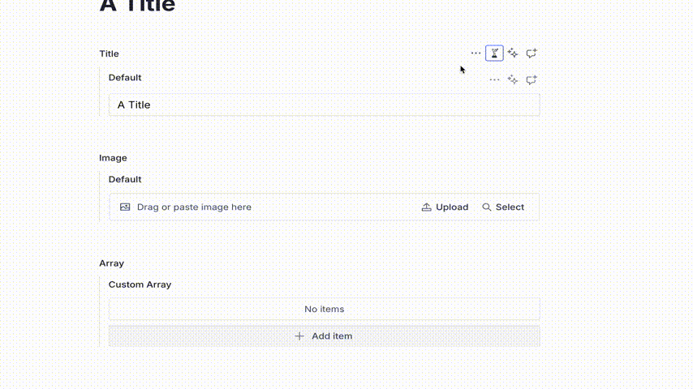
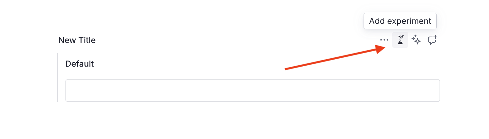
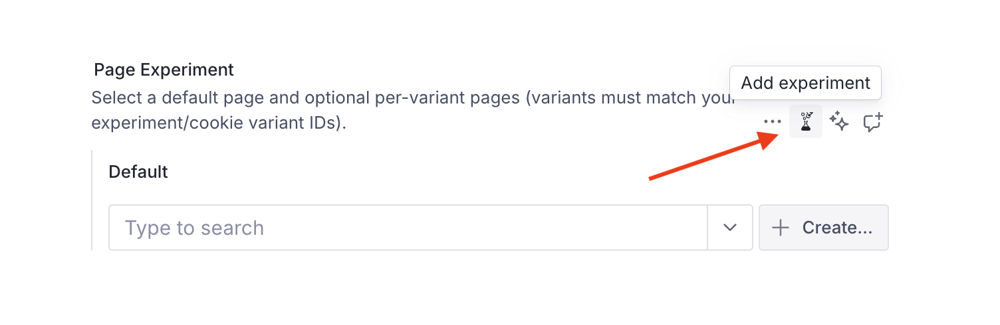

# @sanity/personalization-plugin

## Previously known as @sanity/personalisation-plugin

This plugin allows users to add a/b/n testing experiments to individual fields and page-level experiments.

> **Full Demo**
>
> 🚀 For a full working example of this plugin implemented with Next.js, see the [personalization-plugin-example](https://github.com/demo-repositories/personalization-plugin-example) repository.
>
> 🎬 Watch the [video walkthrough](https://www.loom.com/share/3e1314575b23434eb0aa35ccad9b9592) to see how the plugin works in a Next.js project.




For this plugin you need to define the experiments you are running and the variations those experiments have. Each experiment needs to have an id, a label, and an array of variants that have an id and a label. You can either pass an array of experiments in the plugin config, or you can use and async function to retrieve the experiments and variants from an external service like growthbook, Amplitude, LaunchDarkly... You could even store the experiments in your sanity dataset.

Once configured you can query the values using the ids of the experiment and variant

- [@sanity/personalization-plugin](#sanitypersonalization-plugin)
  - [Previously known as @sanity/personalisation-plugin](#previously-known-as-sanitypersonalisation-plugin)
  - [Installation](#installation)
  - [When to Use This Plugin](#when-to-use-this-plugin)
  - [Usage](#usage)
  - [Loading Experiments](#loading-experiments)
    - [Option 1: Static Array](#option-1-static-array)
    - [Option 2: Fetch from External Service](#option-2-fetch-from-external-service)
    - [Option 3: Store in Sanity Dataset](#option-3-store-in-sanity-dataset)
  - [Using complex field configurations](#using-complex-field-configurations)
  - [Page-Level Experiments](#page-level-experiments)
    - [Step 1: Configure the Plugin with a Reference Field](#step-1-configure-the-plugin-with-a-reference-field)
    - [Step 2: Create a Route Experiment Document Type](#step-2-create-a-route-experiment-document-type)
    - [Step 3: Query the Correct Page](#step-3-query-the-correct-page)
    - [Step 4: Implement Proxy for Routing](#step-4-implement-proxy-for-routing)
  - [Validation of individual array items](#validation-of-individual-array-items)
  - [Shape of stored data](#shape-of-stored-data)
  - [Querying data](#querying-data)
  - [Variant Assignment](#variant-assignment)
    - [Variant ID Consistency](#variant-id-consistency)
    - [Cookie-Based Assignment](#cookie-based-assignment)
    - [Reading Variants in Page Components](#reading-variants-in-page-components)
    - [Third-Party Integration](#third-party-integration)
  - [Split testing (URL-based)](#split-testing-url-based)
    - [Studio Setup](#studio-setup)
    - [Frontend usage](#frontend-usage)
  - [Using experiment fields in an array](#using-experiment-fields-in-an-array)
  - [Overwriting the experiment and variant field names](#overwriting-the-experiment-and-variant-field-names)
    - [Example: Audience Segmentation](#example-audience-segmentation)
    - [Stored Data Structure](#stored-data-structure)
    - [Querying with Custom Field Names](#querying-with-custom-field-names)
  - [License](#license)
  - [Develop \& test](#develop--test)
    - [Release new version](#release-new-version)

> For Specific information about the Growthbook FieldLevel export see its [readme](/growthbook.md)
>
> For Specific information about the LaunchDarkly FieldLevel export see its [readme](/launchdarkly.md)

## Installation

```sh
npm install @sanity/personalization-plugin
```

## When to Use This Plugin

This plugin supports two types of A/B testing:

| Type | Use Case | Example |
|------|----------|---------|
| **Field-Level** | Test different content values on the same page | Different headlines, CTAs, or descriptions |
| **Page-Level** | Test entirely different page layouts | Different homepage designs or landing pages |

**Choose Field-Level when:**
- You want to test a single element (headline, button text, image)
- The page structure stays the same
- You need fine-grained control over individual content pieces

**Choose Page-Level when:**
- You want to test completely different page designs
- Multiple elements change together as part of a cohesive variant
- You're running landing page optimization tests

## Usage

Add it as a plugin in `sanity.config.ts` (or .js):

```ts
import {defineConfig} from 'sanity'
import {fieldLevelExperiments} from '@sanity/personalization-plugin'

// Example: Testing different homepage headlines
const headlineExperiment = {
  id: 'homepage-headline',
  label: 'Homepage Headline Test',
  variants: [
    {
      id: 'control',
      label: 'Control',
    },
    {
      id: 'emotional',
      label: 'Emotional Appeal',
    },
  ],
}

// Example: Testing different signup button text
const ctaExperiment = {
  id: 'signup-cta',
  label: 'Signup CTA Test',
  variants: [
    {
      id: 'control',
      label: 'Control',
    },
    {
      id: 'urgent',
      label: 'Urgency Messaging',
    },
    {
      id: 'benefit',
      label: 'Benefit Focused',
    },
  ],
}

export default defineConfig({
  //...
  plugins: [
    //...
    fieldLevelExperiments({
      fields: ['string'],
      experiments: [headlineExperiment, ctaExperiment],
    }),
  ],
})
```

This will register two new fields to the schema based on the setting passed into `fields:`:

- `experimentString` - An object field with a `string` field called `default`, a `string` field called `experimentId`, and an array field called `variants`
- `variantString` - An object field with a `string` field called `value`, a string field called `variantId`, and a `string` field called `experimentId`

Use the experiment field in your schema like this:

```ts
// Example: blog post with A/B testable title
// In post.ts

fields: [
  defineField({
    name: 'title',
    type: 'experimentString',
  }),
]
```

When editors open a document with this field, they can:
1. Enter a **default value** (shown to users not in an experiment)
2. Click the  **beaker icon** ("Add experiment") to assign an experiment
3. Enter **variant-specific values** for each variant in the experiment



> 💡 **Tip:** Look for the  beaker icon in the field toolbar — clicking it opens the experiment picker where you can assign an experiment and enter variant-specific values.

## Loading Experiments

Experiments must be an array of objects with an `id`, `label`, and an array of `variants` (each with `id` and `label`).

**Important:** The variant `id` values must match what your frontend uses to assign users to variants (typically via cookies).

### Option 1: Static Array

Define experiments directly in your config:

```ts
experiments: [
  {
    id: 'homepage-headline',
    label: 'Homepage Headline Test',
    variants: [
      { id: 'control', label: 'Control' },
      { id: 'emotional', label: 'Emotional Appeal' },
    ],
  },
  {
    id: 'signup-cta',
    label: 'Signup CTA Test',
    variants: [
      { id: 'control', label: 'Control' },
      { id: 'urgent', label: 'Urgency Messaging' },
      { id: 'benefit', label: 'Benefit Focused' },
    ],
  },
]
```

### Option 2: Fetch from External Service

Use an async function to load experiments from services like GrowthBook, Amplitude, or LaunchDarkly:

```ts
experiments: async () => {
  const response = await fetch('https://api.growthbook.io/experiments')
  const {experiments: externalExperiments} = await response.json()

  return externalExperiments?.map((experiment) => ({
    id: experiment.id,
    label: experiment.name,
    variants: experiment.variations?.map((variant) => ({
      id: variant.variationId,
      label: variant.name,
    })),
  }))
}
```

### Option 3: Store in Sanity Dataset

The async function receives a configured Sanity Client, allowing you to store experiments as documents:

```ts
experiments: async (client) => {
  // Fetch experiment documents from your dataset
  const experiments = await client.fetch(`
    *[_type == 'experiment']{
      id,
      label,
      variants[]{id, label}
    }
  `)
  return experiments
}
```

This approach lets content editors create and manage experiments directly in Sanity Studio without code changes.

## Using complex field configurations

For more control over the value field, you can pass a schema definition into the fields array.

```ts
import {defineConfig, defineField} from 'sanity'
import {fieldLevelExperiments} from '@sanity/personalization-plugin'

export default defineConfig({
  //...
  plugins: [
    //...
    fieldLevelExperiments({
      fields: [
        defineField({
          name: 'featuredProduct',
          type: 'reference',
          to: [{type: 'product'}],
          hidden: ({document}) => !document?.title,
        }),
      ],
      experiments: [headlineExperiment, ctaExperiment],
    }),
  ],
})
```

This would also create two new fields in your schema:

- `experimentFeaturedProduct` - An object field with a `reference` field called `default`, a `string` field called `experimentId`, and an array field called `variants`
- `variantFeaturedProduct` - An object field with a `reference` field called `value`, a string field called `variantId`, and a `string` field called `experimentId`

Note that the `name` key in the field definition is used to name the generated field type, while the actual field inside is always called `value`.

## Page-Level Experiments

You can use this plugin to A/B test entire pages by experimenting on reference fields. This is useful when you want to show completely different page content to different user segments.



> 💡 **Tip:** Just like field-level experiments, click the  beaker icon on the reference field to assign an experiment and configure variant-specific pages.

### Step 1: Configure the Plugin with a Reference Field

```ts
import {defineConfig, defineField} from 'sanity'
import {fieldLevelExperiments} from '@sanity/personalization-plugin'

const homepageExperiment = {
  id: 'homepage-redesign',
  label: 'Homepage Redesign Test',
  variants: [
    { id: 'control', label: 'Control (Current Design)' },
    { id: 'variant-a', label: 'Variant A (New Design)' },
  ],
}

export default defineConfig({
  //...
  plugins: [
    fieldLevelExperiments({
      fields: [
        'string',
        // Add a reference field for page-level experiments
        defineField({
          name: 'page',
          type: 'reference',
          to: [{type: 'page'}, {type: 'homePage'}],
        }),
      ],
      experiments: [homepageExperiment],
    }),
  ],
})
```

### Step 2: Create a Route Experiment Document Type

Create a document type to store which pages should be shown for each route:

```ts
import {defineType, defineField} from 'sanity'

export const routeExperiment = defineType({
  name: 'routeExperiment',
  title: 'Route Experiment',
  type: 'document',
  fields: [
    defineField({
      name: 'name',
      title: 'Experiment Name',
      type: 'string',
      validation: (Rule) => Rule.required(),
    }),
    defineField({
      name: 'targetRoute',
      title: 'Target Route',
      type: 'string',
      description: 'The URL path this experiment applies to (e.g., "/" for homepage)',
      validation: (Rule) => Rule.required(),
    }),
    defineField({
      name: 'isActive',
      title: 'Active',
      type: 'boolean',
      initialValue: false,
    }),
    defineField({
      name: 'page',
      title: 'Page',
      type: 'experimentPage', // Auto-generated by the plugin
      description: 'Select default page and variant pages',
    }),
  ],
})
```

### Step 3: Query the Correct Page

Use GROQ to resolve the correct page based on experiment and variant:

```ts
const ROUTE_EXPERIMENT_QUERY = `
  *[_type == "routeExperiment" && targetRoute == $path && isActive == true][0]{
    "page": coalesce(
      page.variants[experimentId == $experimentId && variantId == $variantId][0].value,
      page.default
    )->{
      _id,
      _type,
      title,
      slug,
      // ... other page fields
    }
  }
`
```

> The `slug` field is required for the slug-based path rewrite (Option B in Step 4).

### Step 4: Implement Proxy for Routing

In your frontend (e.g., Next.js proxy), determine which page to serve. Two approaches are supported:

**Option A: Same URL (pageId query param)** — Keeps the visible URL stable. Best for A/B tests where users always see the same path.

```ts
// proxy.ts
import {NextResponse} from 'next/server'
import type {NextRequest} from 'next/server'

export async function proxy(request: NextRequest) {
  const pathname = request.nextUrl.pathname
  
  // Get user's assigned variant from cookie
  const variantId = request.cookies.get('ab-variant')?.value || 'control'
  
  // Fetch the experiment configuration
  const data = await client.fetch(ROUTE_EXPERIMENT_QUERY, {
    path: pathname,
    experimentId: 'homepage-redesign',
    variantId: variantId,
  })
  
  if (data?.page) {
    // Rewrite to the selected page (same URL, pass pageId)
    const url = request.nextUrl.clone()
    url.searchParams.set('pageId', data.page._id)
    return NextResponse.rewrite(url)
  }
  
  return NextResponse.next()
}
```

**Option B: Slug-based path rewrite** — Rewrites the URL to the variant page's slug. Use when your app routes by slug (e.g. `app/[[...slug]]/page.tsx`) and you want the URL to reflect the variant.

```ts
  if (data?.page?.slug?.current) {
    // Rewrite to the variant's slug path
    const url = request.nextUrl.clone()
    url.pathname = `/${data.page.slug.current}`
    return NextResponse.rewrite(url)
  }
  // If slug is missing, the request continues without rewriting
```

## Validation of individual array items

You may wish to validate individual fields for various reasons. From the variant array field, add a validation rule that can look through all the array items, and return item-specific validation messages at the path of that array item.

```ts
defineField({
  name: 'title',
  title: 'Title',
  type: 'experimentString',
  validation: (rule) =>
    rule.custom((experiment: ExperimentGeneric<string>) => {
      if (!experiment.default) {
        return 'Default value is required'
      }

      const invalidVariants = experiment.variants?.filter((variant) => !variant.value)

      if (invalidVariants?.length) {
        return invalidVariants.map((item) => ({
          message: `Variant is missing a value`,
          path: ['variants', {_key: item._key}, 'value'],
        }))
      }
      return true
    }),
}),
```

## Shape of stored data

The custom input contains buttons which will add new array items with the experiment and variant already populated. Data returned from this field will look like this:

```json
"title": {
  "default": "Welcome to Our Platform",
  "experimentId": "homepage-headline",
  "variants": [
    {
      "experimentId": "homepage-headline",
      "variantId": "control",
      "value": "Welcome to Our Platform"
    },
    {
      "experimentId": "homepage-headline",
      "variantId": "emotional",
      "value": "Transform Your Life Today"
    }
  ]
}
```

In this example:
- `default` is shown to users not in an experiment
- `control` variant shows "Welcome to Our Platform"
- `emotional` variant shows "Transform Your Life Today"

## Querying data

Use GROQ's `coalesce` function to query for a specific variant with a fallback to the default value:

```ts
// Fetch blog posts with experiment-aware title
*[_type == "post"] {
  "title": coalesce(
    title.variants[experimentId == $experimentId && variantId == $variantId][0].value,
    title.default
  ),
  // ... other fields
}
```

On your frontend, pass the experiment and variant IDs as query parameters:

```ts
const posts = await client.fetch(query, {
  experimentId: 'homepage-headline',
  variantId: userVariant, // e.g., 'control' or 'emotional'
})
```

This pattern ensures:
1. Users in the experiment see their assigned variant's content
2. Users not in an experiment see the default value
3. The query works even if no variants are defined (falls back to default)

## Variant Assignment

For experiments to work, your frontend must assign users to variants and pass the correct variant ID when querying content.

### Variant ID Consistency

**Important:** The variant IDs in your plugin configuration must match exactly what your frontend uses.

```ts
// Studio config - these IDs must match your frontend
const experiment = {
  id: 'homepage-headline',
  variants: [
    { id: 'control', label: 'Control' },      // ID: 'control'
    { id: 'variant-a', label: 'Variant A' },  // ID: 'variant-a'
  ],
}
```

### Cookie-Based Assignment

The most common approach is to assign variants via cookies on first visit. Using MurmurHash with a userId gives better distribution and deterministic assignment (the same user always gets the same variant):

```ts
// In Next.js proxy (proxy.ts)
import {NextResponse} from 'next/server'
import type {NextRequest} from 'next/server'
import {v4} from 'uuid'
import MurmurHash3 from 'imurmurhash'

const COOKIE_MAX_AGE = 60 * 60 * 24 * 30 // 30 days

export function proxy(request: NextRequest) {
  const response = NextResponse.next()
  
  // Check if user already has a variant
  let variant = request.cookies.get('ab-variant')?.value
  
  if (!variant) {
    // Use logged-in user ID if available, else persisted or new anonymous ID
    const userId =
      getUserIdFromSession(request) ?? // Implement: return session?.user?.id etc.
      request.cookies.get('ab-user-id')?.value ??
      v4()

    // Deterministic variant from hash (same userId → same variant)
    variant = MurmurHash3(userId).result() % 2 ? 'control' : 'variant-a'

    response.cookies.set('ab-variant', variant, { maxAge: COOKIE_MAX_AGE, path: '/' })
    // Persist anonymous ID when we created a new one (stable until user logs in)
    if (!getUserIdFromSession(request) && !request.cookies.get('ab-user-id')?.value) {
      response.cookies.set('ab-user-id', userId, { maxAge: COOKIE_MAX_AGE, path: '/' })
    }
  }
  
  return response
}
```

> **Tip:** Install with `npm install uuid imurmurhash`. When a user logs in, update the `ab-user-id` cookie to their real user ID so variant assignment stays consistent across sessions.

### Reading Variants in Page Components

In your page components, read the variant from cookies:

```ts
import { cookies } from 'next/headers'

async function getVariant(): Promise<string> {
  const cookieStore = await cookies()
  const abCookie = cookieStore.get('ab-variant')?.value
  return abCookie || 'control'
}

export default async function Page() {
  const variant = await getVariant()
  
  const data = await client.fetch(query, {
    experimentId: 'homepage-headline',
    variantId: variant,
  })
  
  // Render with experiment-aware content
}
```

### Third-Party Integration

For advanced use cases, you can integrate with experimentation platforms like GrowthBook, LaunchDarkly, or Amplitude. These platforms handle variant assignment and provide analytics. See the [GrowthBook](/growthbook.md) and [LaunchDarkly](/launchdarkly.md) integration guides for details.

## Split testing (URL-based)

Split testing involves routing users at one URL to different pages. Use this when you want to test completely different page layouts, not just individual fields.

### Studio Setup

First, define a custom path type for URL validation:

```ts
import {defineType} from 'sanity'

export const path = defineType({
  name: 'path',
  type: 'string',
  validation: (Rule) =>
    Rule.required().custom(async (value: string | undefined) => {
      if (!value) return true
      if (!value.startsWith('/')) return 'Must start with "/"'
      return true
    }),
})
```

Add the path type to your schema and plugin config:

```ts
fieldLevelExperiments({
  fields: ['path', 'string'], // Include 'path' for URL experiments
  experiments: [
    {
      id: 'landing-page-test',
      label: 'Landing Page A/B Test',
      variants: [
        { id: 'control', label: 'Control' },
        { id: 'variant-a', label: 'Variant A' },
      ],
    },
  ],
}),
```

Create a document type to store routing experiments:

```ts
import {defineType, defineField} from 'sanity'

export const routing = defineType({
  name: 'routing',
  type: 'document',
  title: 'URL Split Tests',
  fields: [
    defineField({
      name: 'pathExperiment',
      title: 'URL Path Experiment',
      type: 'experimentPath',
      initialValue: {active: true},
      description: 'Set the default URL and variant URLs for this test',
    }),
  ],
  preview: {
    select: {
      path: 'pathExperiment.default',
      experiment: 'pathExperiment.experimentId',
    },
    prepare({path, experiment}) {
      return {
        title: `${path}`,
        subtitle: `Experiment: ${experiment || 'None'}`,
      }
    },
  },
})
```

### Frontend usage

Use a proxy to intercept requests and route users to the appropriate page based on their variant assignment:

```ts
// proxy.ts
import {NextResponse} from 'next/server'
import type {NextRequest} from 'next/server'
import {v4} from 'uuid'
import MurmurHash3 from 'imurmurhash'
import {client} from './lib/sanity'

const ROUTING_QUERY = `*[
  _type == "routing" &&
  pathExperiment.default == $path
][0]{
  "route": coalesce(
    pathExperiment.variants[experimentId == $experimentId && variantId == $variantId][0].value,
    pathExperiment.default
  )
}`

const COOKIE_MAX_AGE = 60 * 60 * 24 * 30 // 30 days

export async function proxy(request: NextRequest) {
  const pathname = request.nextUrl.pathname
  
  // Get user's variant from cookie (set on first visit)
  let variantId = request.cookies.get('ab-variant')?.value
  
  const response = NextResponse.next()

  if (!variantId) {
    const userId =
      getUserIdFromSession(request) ?? // Implement: return session?.user?.id etc.
      request.cookies.get('ab-user-id')?.value ??
      v4()
    variantId = MurmurHash3(userId).result() % 2 ? 'control' : 'variant-a'
    if (!getUserIdFromSession(request) && !request.cookies.get('ab-user-id')?.value) {
      response.cookies.set('ab-user-id', userId, { maxAge: COOKIE_MAX_AGE, path: '/' })
    }
  }
  response.cookies.set('ab-variant', variantId, { maxAge: COOKIE_MAX_AGE, path: '/' })

  // Query for URL routing experiments
  const data = await client.fetch(ROUTING_QUERY, {
    path: pathname,
    experimentId: 'landing-page-test',
    variantId: variantId,
  })
  
  if (data?.route && data.route !== pathname) {
    const url = request.nextUrl.clone()
    url.pathname = data.route
    const rewrite = NextResponse.rewrite(url)
    // Preserve the cookie on the rewrite response
    rewrite.cookies.set('ab-variant', variantId, { maxAge: COOKIE_MAX_AGE, path: '/' })
    return rewrite
  }

  return response
}

export const config = {
  matcher: ['/((?!api|_next/static|_next/image|favicon.ico|sitemap.xml|robots.txt).*)'],
}
```

**Tip:** For better performance, consider querying all routing experiments at build time and caching them, rather than fetching on every request.

## Using experiment fields in an array

You may want to add experiment fields as a type with in an array in oder to do this you would need to set an initial value for the experiment to active the schema would be something like:

```ts
defineField({
      name: 'components',
      type: 'array',
      of: [
        defineArrayMember({type: 'cta', name: 'cta'}),
        defineArrayMember({type: 'experimentCta', name: 'expCta', initialValue: {active: true}}),
        defineArrayMember({type: 'hero', name: 'hero'}),
        defineArrayMember({type: 'experimentHero', name: 'expHero', initialValue: {active: true}}),
      ],
      group: 'editorial',
    }),
```

You can then use a groq filter to return the base version of you array member so you don't have to create an experiment specific version

```ts
*[
  _type == "event" &&
  slug.current == $slug
][0]{
  ...,
  components[]{
    _key,
    ...,
    string::startsWith(_type, "exp") => {
      ...coalesce(@.variants[experimentId == $experiment && variantId == $variant][0].value, @.default),
    },
  }
}`);
```

## Overwriting the experiment and variant field names

If your use case doesn't match the "experiment/variant" terminology, you can rename these fields. This is useful for:

- **Audience-based personalization**: Show different content to different user segments (e.g., "enterprise customers" vs "small business")
- **Locale-based content**: Display region-specific messaging
- **Feature flags**: Toggle content based on feature availability

### Example: Audience Segmentation

```ts
import {defineConfig} from 'sanity'
import {fieldLevelExperiments} from '@sanity/personalization-plugin'

// Define your audiences and segments
const audiences = [
  {
    id: 'customer-type',
    label: 'Customer Type',
    variants: [
      { id: 'enterprise', label: 'Enterprise' },
      { id: 'small-business', label: 'Small Business' },
      { id: 'individual', label: 'Individual' },
    ],
  },
  {
    id: 'subscription-tier',
    label: 'Subscription Tier',
    variants: [
      { id: 'free', label: 'Free Tier' },
      { id: 'pro', label: 'Pro Tier' },
      { id: 'enterprise', label: 'Enterprise Tier' },
    ],
  },
]

export default defineConfig({
  //...
  plugins: [
    fieldLevelExperiments({
      fields: ['string'],
      experiments: audiences,
      experimentNameOverride: 'audience',
      variantNameOverride: 'segment',
    }),
  ],
})
```

This creates two new fields in your schema:

- `audienceString` - An object field with a `string` field called `default`, a `string` field called `audienceId`, and an array field called `segments`
- `segmentString` - An object field with a `string` field called `value`, a string field called `segmentId`, and a `string` field called `audienceId`

### Stored Data Structure

The data will be stored with your custom field names:

```json
"headline": {
  "default": "Welcome to Our Platform",
  "audienceId": "customer-type",
  "segments": [
    {
      "audienceId": "customer-type",
      "segmentId": "enterprise",
      "value": "Enterprise-Grade Solutions for Your Team"
    },
    {
      "audienceId": "customer-type",
      "segmentId": "small-business",
      "value": "Grow Your Business with Powerful Tools"
    },
    {
      "audienceId": "customer-type",
      "segmentId": "individual",
      "value": "Your Personal Productivity Hub"
    }
  ]
}
```

### Querying with Custom Field Names

Update your GROQ queries to use the renamed fields:

```ts
*[_type == "landingPage"] {
  "headline": coalesce(
    headline.segments[audienceId == $audience && segmentId == $segment][0].value,
    headline.default
  ),
}
```

On your frontend, pass the audience and segment:

```ts
const page = await client.fetch(query, {
  audience: 'customer-type',
  segment: userSegment, // e.g., 'enterprise', 'small-business', or 'individual'
})
```

## License

[MIT](LICENSE) © Jon Burbridge

## Develop & test

This plugin uses [@sanity/plugin-kit](https://github.com/sanity-io/plugin-kit)
with default configuration for build & watch scripts.

See [Testing a plugin in Sanity Studio](https://github.com/sanity-io/plugin-kit#testing-a-plugin-in-sanity-studio)
on how to run this plugin with hotreload in the studio.

### Release new version

Run ["CI & Release" workflow](https://github.com/sanity-io/sanity-plugin-personalization/actions/workflows/main.yml).
Make sure to select the main branch and check "Release new version".

Semantic release will only release on configured branches, so it is safe to run release on any branch.